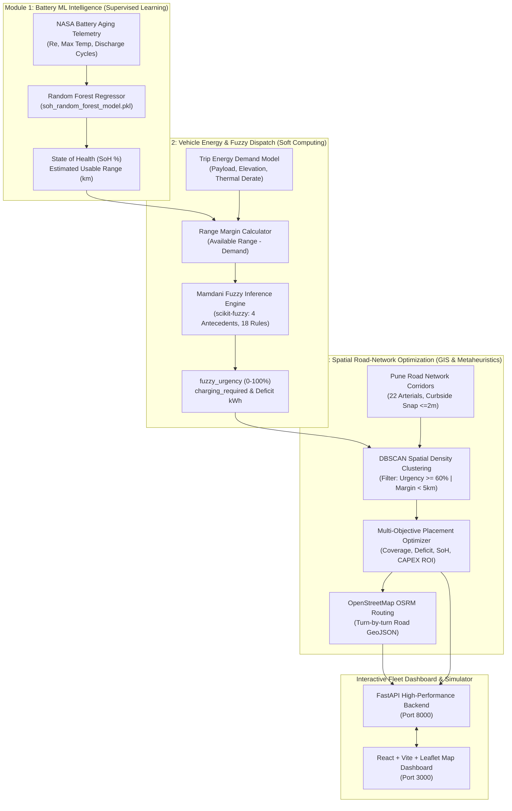

# Range Intelligence: Soft Computing & Machine Learning for EV Fleet Infrastructure

An end-to-end, multi-tier intelligent system for Commercial Electric Vehicle (EV) fleets. Combines **Machine Learning (Random Forest)**, **Soft Computing (Fuzzy Logic Inference)**, and **Geospatial Optimization (DBSCAN + Multi-Objective Genetic Algorithms)** to predict battery health, evaluate dispatch feasibility, and optimize urban charging infrastructure placement across Pune, India.

---

## System Architecture



---

## Soft Computing & Machine Learning Concepts

This project integrates three complementary pillars of computational intelligence:

### 1. Module 1 — Machine Learning (Supervised Random Forest Regression)
- **Dataset**: NASA Battery Aging Experimental Telemetry (Cells B0005, B0006, B0007, B0018).
- **Extracted Battery Degradation Features**:
  - `internal_resistance_re`: Ohmic electrolyte resistance measuring electrochemical impedance.
  - `time_since_reset_cycles`: Cumulative charge/discharge cycle aging counter.
  - `max_temp_reached`: Peak thermal excursion during active discharge.
  - `charge_rate_proxy`: Ratio of current density during operational charging.
  - `discharge_index`: Depth of discharge operational baseline.
- **Model**: Scikit-Learn `RandomForestRegressor` trained to predict:
  $$\text{SoH} = \frac{C_{\text{current}}}{C_{\text{nominal}}} \times 100\%$$
  $$\text{Usable Range (km)} = \text{Rated Range} \times \frac{\text{SoH}}{100}$$

### 2. Module 2 — Soft Computing (Mamdani Fuzzy Logic Inference)
- **Vehicle Energy Physics Model**:
  Computes effective driving demand factoring payload, thermal losses, and elevation:
  $$E_{\text{demand}} = d_{\text{trip}} \times k_{\text{base}} \times \tau_{\text{terrain}} \times \eta_{\text{temp}} \times \mu_{\text{payload}}$$
  where:
  - $\tau_{\text{terrain}} \in \{1.00 \text{ (Flat)}, 1.15 \text{ (Hilly)}, 1.35 \text{ (Mountain)}\}$
  - $\eta_{\text{temp}}$ applies piece-wise thermal derating for extreme heat ($>32^\circ\text{C}$) and cold ($<20^\circ\text{C}$)
  - $\mu_{\text{payload}} = 1.0 + (m_{\text{load}} - 150) \times 0.0015$
- **Fuzzy Inference System (`scikit-fuzzy`)**:
  Handles real-world ambiguity in dispatch readiness using 4 linguistic antecedents:
  1. `soh_percent`: [Critical, Degraded, Healthy]
  2. `initial_soc_percent`: [Low, Medium, High]
  3. `effective_trip_demand_km`: [Short, Medium, Long]
  4. `range_margin_km`: [Negative_Critical, Low_Risk, Adequate, Surplus]
- **Defuzzification**: Centroid Mamdani defuzzification computing a continuous dispatch priority score $\text{fuzzy\_urgency} \in [0, 100]\%$.

### 3. Module 3 — Geospatial Optimization & Metaheuristics
- **Authentic Pune Road Network**: 22 high-density delivery corridors (Hinjawadi, Wakad, Baner, SB Road, Swargate, Nagar Road, Kharadi, Hadapsar, Bhosari MIDC) with dense waypoints every 150m–350m and curbside micro-jitter ($\le 2\text{m}$).
- **Negative GIS Exclusion Masking**: Rigorously rejects points falling on water bodies (Mula/Mutha riverbeds, Pashan Lake, Khadakwasla) and steep uninhabited hills (Vetal Tekdi, Taljai).
- **DBSCAN Spatial Density Clustering**: Identifies un-served energy deficit centroids ($d_{\text{haversine}}$ metric, $\varepsilon = 1.8\text{ km}$, $\text{min\_samples} = 4$).
- **Multi-Objective Placement Optimization**:
  Maximizes deficit fulfillment while enforcing urban circuity ($\tau = 1.32$), minimum station spacing ($2.0\text{ km}$), and snapping to verified commercial forecourts and metro depots.
- **Street-Level Routing**: OpenStreetMap OSRM routing engine generating turn-by-turn GeoJSON navigation paths across roads and bridges.

---

## Directory Structure

```
softcomputing/
├── .gitignore                     # Git configuration (tracks runners & code)
├── README.md                      # Comprehensive project documentation
├── requirements.txt               # Unified Python dependency manifest
├── run.bat                        # One-click Windows runner (interactive terminal)
├── run_local.py                   # Cross-platform runner (FastAPI + Vite unified)
│
├── module1/                       # Module 1: Battery ML Intelligence
│   ├── ML_Engineered_Battery_Dataset.csv
│   ├── Readme1.md                 # Module 1 standalone documentation
│   ├── soh_random_forest_model.pkl# Frozen pre-trained Random Forest model
│   └── test_predictions.csv       # Telemetry evaluation & test split
│
├── module2/                       # Module 2: Energy Model & Fuzzy Dispatch
│   ├── adapter.py                 # Frozen Module 1 model adapter
│   ├── config.py                  # Vehicle specs & fuzzy thresholds
│   ├── energy_model.py            # Physics-based energy consumption engine
│   ├── fuzzy_system.py            # scikit-fuzzy Mamdani inference engine
│   ├── margin_calculator.py       # Range margin & safety buffer calculator
│   ├── pipeline.py                # End-to-end single/batch trip evaluation
│   ├── recommendation.py          # Automated dispatch recommendation rules
│   └── synthetic_data.py          # Grounded trip generator with road corridors
│
└── module3/                       # Module 3: Spatial Road Optimizer & Dashboard
    ├── api.py                     # FastAPI REST API endpoints
    ├── clustering.py              # DBSCAN spatial deficit clustering engine
    ├── config.py                  # Commercial candidate parcels & GIS settings
    ├── demand_forecast.py         # 24-hour diurnal fleet load forecasting
    ├── optimizer.py               # Station placement optimizer & fleet ROI
    ├── pune_road_network.py       # 22 Pune road corridors & exclusion zones
    ├── routing.py                 # OpenStreetMap OSRM street-routing client
    ├── run_module3.py             # Standalone Module 3 CLI runner
    ├── service.py                 # Core business logic service
    ├── data/                      # Auto-generated cached fleet trip datasets
    ├── frontend/                  # Modern React + Vite Dashboard
    │   ├── src/
    │   │   ├── App.jsx            # Main dashboard shell & tab controller
    │   │   ├── index.css          # Dark-mode glassmorphic theme styling
    │   │   └── components/
    │   │       ├── StationPlacementMap.jsx # Interactive Leaflet map & routes
    │   │       ├── FleetHealthView.jsx     # Fleet SoH breakdown & risk cohorts
    │   │       ├── DemandForecastView.jsx  # Diurnal power curves & peak shifts
    │   │       └── TripSimulatorModal.jsx  # Live pre-trip fuzzy dispatch modal
    │   ├── package.json
    │   └── vite.config.js
    └── tests/
        └── test_module3.py        # Complete automated test suite (11 tests)
```

---

## Quickstart Guide

### Prerequisites
- **Python 3.10+** (Python 3.11 recommended)
- **Node.js 18+** & **npm**
- **Git**

---

### 1. Clone the Repository
```bash
git clone https://github.com/SumitGavali/softcomputing.git
cd softcomputing
git checkout module-3/charging-demand-station-placement
```

---

### 2. Install Python Dependencies
```bash
pip install -r requirements.txt
```

---

### 3. Run the Unified Application

#### Option A — Windows One-Click (Recommended)
Double-click `run.bat` or run it from your IDE terminal:
```cmd
.\run.bat
```

#### Option B — Cross-Platform Python Runner
Run directly with Python (works on Windows, macOS, and Linux):
```bash
python run_local.py
```

> [!TIP]
> **First-Time Setup**: `run_local.py` automatically detects if frontend packages are missing and executes `npm install` inside `module3/frontend/` for you.
>
> **Live Color-Coded Logs**: The runner streams backend logs in **Cyan** (`[BACKEND]`) and frontend logs in **Emerald** (`[FRONTEND]`) in a single terminal. Press `Ctrl + C` once to cleanly terminate both processes without orphan ports.

---

### 4. Access the Dashboard
Once launched, open your web browser:
- **Interactive Web Dashboard**: [http://localhost:3000](http://localhost:3000)
- **FastAPI Interactive Swagger Docs**: [http://localhost:8000/docs](http://localhost:8000/docs)

---

## API Endpoints Reference

All endpoints are served by the unified FastAPI server on port `8000`:

| Endpoint | Method | Description |
| :--- | :---: | :--- |
| `/module3/health` | `GET` | Health check and module operational status |
| `/module3/fleet/overview` | `GET` | Fleet average SoH, vehicle degradation cohorts (Healthy/Monitor/At-Risk), and deficit totals |
| `/module3/stations/recommendations` | `GET` | Top $k$ station locations, coverage radius, hardware sizing, and annualized financial ROI |
| `/module3/heatmap/deficits` | `GET` | Geolocated deficit coordinates with fuzzy urgency weights for map overlays |
| `/module3/demand/hourly` | `GET` | 24-hour diurnal power load profile, peak surge windows, and recommended off-peak shift |
| `/module3/routes/hub-assignment` | `GET` | Authentic GeoJSON road driving routes from OpenStreetMap OSRM connecting hubs to deficit points |
| `/module3/simulate/trip` | `POST` | Pre-trip dispatch simulator running live `scikit-fuzzy` inference and physics calculations |

---

## Running Automated Tests

Run the complete test suite with `pytest`:
```bash
py -3.11 -m pytest module3/tests/ -v
```
All 11 unit and integration tests validate Haversine distance, landmark geocoding, DBSCAN clustering, station optimization, ROI financial models, diurnal load forecasting, and live fuzzy simulator endpoints.
